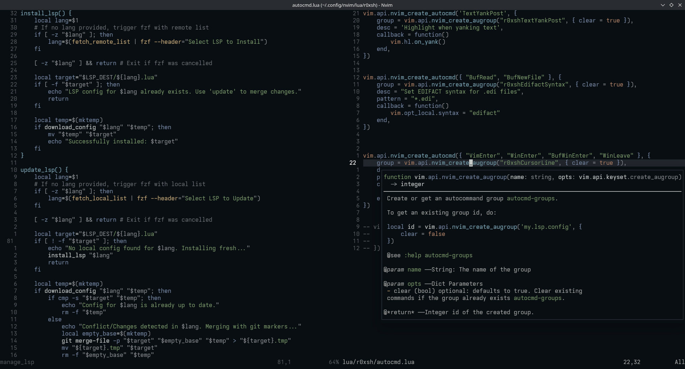

# Neovim Configuration

A minimal λet functional Neovim configuration with modern LSP support and a clean workflow.

## Font
Using **Ioskeley Mono** as the primary font.

## `manage_lsp` script
Custom bash script for manual LSP configuration management. Downloads LSP configs directly from nvim-lspconfig repository instead of using the package as a dependency.

**Why this approach?**

I prefer manual LSP configuration control over installing lsp-config as a dependency because:
- Full customization freedom without fighting upstream changes
- Stability - configs won't break randomly from package updates
    - Conservative upstream maintainers are appreciated, but I want absolute control over my LSP setup
- Can cherry-pick specific configs and modify them as needed

The script supports installing/updating individual LSP configs with conflict resolution using git merge markers.

## Structure
- `lua/r0xsh/` - Main configuration modules
- `lua/r0xsh/plugins/` - Plugin configurations
- `lsp/` - Language server configurations (managed by `manage_lsp`)
- `syntax/` - Custom syntax highlighting
