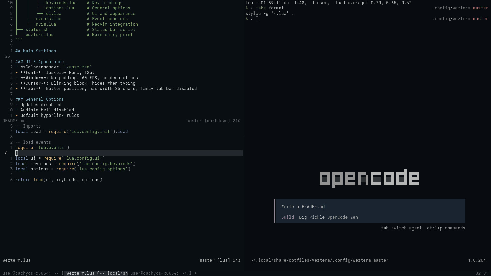

# WezTerm Configuration



A modular WezTerm configuration with a focus on Vi-like navigation and clean UI.

## Structure

```
├── colors/
│   └── kanso-zen.lua       # Custom colorscheme
├── lua/
│   ├── config/
│   │   ├── init.lua        # Config loader
│   │   ├── keybinds.lua    # Key bindings
│   │   ├── options.lua     # General options
│   │   └── ui.lua          # UI and appearance
│   ├── events.lua          # Event handlers
│   └── nvim.lua            # Neovim integration
├── status.sh               # Status bar script
└── wezterm.lua             # Main entry point
```

## Main Settings

### UI & Appearance
- **Colorscheme**: `kanso-zen`
- **Font**: Ioskeley Mono, 12pt
- **Window**: No padding, 60 FPS, no decorations
- **Cursor**: Blinking block, hides when typing
- **Tabs**: Bottom position, max width 25 chars, fancy tab bar disabled

### General Options
- Updates disabled
- Audible bell disabled
- Default hyperlink rules
- Status update interval: 5000ms

### Tab Behavior
- Show tab bar even with single tab
- Switch to last active tab when closing
- Tab bar at bottom

## Key Bindings

**Leader**: `Ctrl+W` (timeout: 1250ms)

### Window Management
| Key | Action |
|-----|--------|
| `Ctrl+Shift+N` | Toggle fullscreen |
| `Ctrl+Shift+T` | New tab |
| `Ctrl+Shift+R` | Reload configuration |

### Pane Management
| Key | Action |
|-----|--------|
| `Ctrl+W Ctrl+s` | Split vertical |
| `Ctrl+W Ctrl+v` | Split horizontal |
| `Ctrl+W Ctrl+z` | Zoom pane |
| `Ctrl+W Ctrl+=` | Unzoom pane |

### Navigation (Vi-style)
| Key | Action |
|-----|--------|
| `Ctrl+W h` | Activate left pane |
| `Ctrl+W j` | Activate down pane |
| `Ctrl+W k` | Activate up pane |
| `Ctrl+W l` | Activate right pane |
| `Ctrl+W q` | Close pane |

### Copy & Paste
| Key | Action |
|-----|--------|
| `Ctrl+Shift+C` | Copy to clipboard |
| `Ctrl+Shift+V` | Paste from clipboard |

### Scrolling
| Key | Action |
|-----|--------|
| `Shift+PageUp` | Scroll up 75% |
| `Shift+PageDown` | Scroll down 75% |

### Tab Navigation
| Key | Action |
|-----|--------|
| `Alt+1-0` | Activate tab 1-10 |
| `Alt+1-0` | Activate tab 1-10 |
| `Alt+Shift+1-0` | Move tab to position 1-10 |
| `Alt+T` | New tab |

### Other
| Key | Action |
|-----|--------|
| `Ctrl+Shift+L` | Debug overlay |
| `Ctrl+Shift+P` | Command palette |
| `Ctrl+Shift+U` | Character select |
| `Ctrl+Click` | Open link |

## Features

### Neovim Integration
The config includes custom Neovim integration that maps Vim window commands to WezTerm actions, allowing seamless navigation between editor panes and terminal panes.

### Status Bar
Custom status bar displayed on the right side, powered by `status.sh`.

### Tab Formatting
Tabs show zoomed state indicator using NerdFont icons when a pane is zoomed.

The configuration automatically loads all modules and applies the settings.
